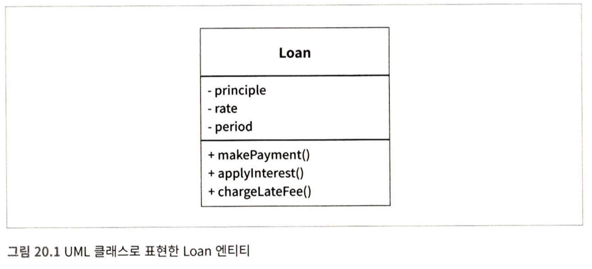

# Temp

- 20. 업무규칙
    - 서론
        - 애플리케이션을 업무 규칙과 플러그인으로 구분해야 한다.
        - 업무 규칙은 사업적으로 수익을 얻거나 비용을 줄일 수 있어야 한다.
        - 핵심 규칙과 핵심 데이터는 본질적으로 결합되어있다.
        - 이러한 유형의 객체를 엔티티라고 하겠다.
    - 엔티티
      
        
        
        - 엔티티는 핵심 업무 데이터를 기반으로 동작하는 일련의 조그만 핵심 업무 규칙을 구체화 한다.
        - 엔티티는  한데 모으고, 나머지 자동화 시스템의 모든 고려사항과 분리되어 있어야 한다.
        - 엔티티는 데이터베이스, 사용자 인터페이스, 서드파티 프레임워크에 대한 고려사항들로 인해 오염되어서는 절대 안된다.
        - 엔티티는 꼭 클래스일 필요는 없다. 다만, 핵심 업무 데이터와 핵심 업무 규칙을 하나로 묶어서 별도의 소프트웨어 모듈로 만들어야 한다.
    - 유스케이스
        - 유스케이스는 자동화된 시스템이 동작하는 방법을 정의하고 제약함으로써 수익을 얻거나 비용을 줄이는 업무규칙이다.
        - 유스케이스는 엔티티 내부의 핵심 업무 규칙을 어떻게, 그리고 언제 호출할 지를 명시하는 규칙을 담는다. 엔티티가 어떻게 출을 출지 유스케이스가 제어하는 것이다.
        - 시스템에서 데이터 입출력은 유스케이스와 무관하다.
        - 유스케이스는 입출력 데이터, 상호작용하는 엔티티에 대한 참조 데이터 등의 요소를 포함한다.
        - 고수준인 엔티티는 유스케이스를 모르나, 입출력과 가까운 고수준인 유스케이스는 엔티티를 알고 있다.
    - 요청 및 응답 모델
        - 제대로 구성된 유스케이스 객체라면 데이터를 사용자, 혹은 다른 컴포넌트와 주고 받는 방식에 대해서는 전혀 눈치 챌 수 없어야 한다.
        - 요청/응답 모델과 유스케이스는 목적이 완전히 다름으로 절대로 유스케이스에 응답 및 요청 데이터를 포함하지 말라.
    - 결론
        - 업무 규칙은 SW의 존재의 이유이다.
        - 때문에 UI, DB 등과 같은 저수준의 관심사로 인해 오염되서는 안 되며, 원래 그대로의 모습으로 남아 있어야 한다.
        - 업무 규칙은 시스템의 심장부에 위치하고 있어야 하고, 그외 코드는 모두 업무 규칙에 플러그인되어야 한다.
        - 업무 규칙은 시스템에서 가장 독립적이며 가장 많이 재사용할 수 있는 코드여야 한다.
- 21. 소리치는 아키텍처
    - 서론
        - 상위 수준의 디렉터리 구조, 최상위 페키지에 담긴 소스 파일을 볼 때, “헬스 케어 시스템이야”, “재고 관리 시스템이야”와 같은 앱의 목적이 나와야지, “레일스야”, ”스프링이야”와 같은 기술적인 부분이 나와서는 안된다.
    - 아키텍처의 테마
        - 아키텍처는 애플리케이션의 유스케이스에 대해 소리쳐야 한다.
    - 아키텍처의 목적
        - 좋은 아키텍처는 유스케이스를 그 중심에 두기 때문에, 프레임워크나 도구, 환경에 전혀 구애받지 않고 유스케이스를 지원하는 구조를 아무런 문제 없이 기술 할 수 있다.
        - 좋은 아키텍처는 프레임워크, 디비, 웹 서버 등의 여타 개발 환경 문제나 도구에 대해서는 결정을 미룰 수 있도록 만든다.
        - 좋은 아키텍처는 유스케이스에 중점을 두며, 지엽적인 관심사에 대한 결합은 분리시킨다.
    - 하지만 웹은?
        - 웹은 단순한 전달 메커니즘이며 아키텍쳐가 아니다.
    - 프레임워크는 도구일 뿐, 삶의 방식은 아니다.
        - 프레임워크도 아키텍처가 아니다.
    - 테스트하기 쉬운 아키텍처
        - 아키텍처가 유스케이스를 최우선으로 한다면, 프레임워크가 없더라도 유스케이스 전부에 대해 단위 테스트를 할 수 있어야 한다.
    - 결론
        - 새로 합류한 프로그래머가 시스템에 대해 모르더라도 시스템의 유스케이스에 대하여 이해할 수 있어야 한다.
- 22. 클린 아키텍처
    
    
    
    - 서론
        - 여러 훌륭한 아키텍처들의 공통의 목적은 관심사 분리이다.
        - 이 아키들은 다음과 같은 특징을 가지고 있다.
            - 프레임워크 독립성
            - 테스트 용이성
            - UI 독립성
            - 디비 독립성
            - 모든 외부 에이전시에 대한 독립성
    - 의존성 규칙
        - 소스 코드 의존성은 반드시 안쪽으로, 고수준의 정책을 향해야 한다.
        - 엔티티
            - 기업의 다양한 애플리케이션에서 엔티티를 재사용할 수만 있다면, 그 형태는 그다지 중요하지 않다.
            - 엔티티는 메서드를 가지는 객체이거나 일련의 데이터 구조와 함수의 집합일 수도 있다.
        - 유스케이스
            - 애플리케이션에 특화된 업무 규칙을 포함한다.
            - 유스케이스는 엔티티로 들어오고 나가는 데이터 흐름을 조정하며, 엔티티가 자신의 핵심 업무 규칙을 사용해서 유스케이스의 목적을 달성하도록 이끈다.
            - 유스케이스 계층은 디비, UI 또는 여타 공통 프레임워크와 같은 외부 요소에서 발생한 변경에 영향을 받지 않아야 한다.
        - 인터페이스 어댑터
            - 인터페이스 어댑터 계층은 일련의 어댑터들로 구성된다.
            - 어댑터는 데이터를 유스케이스와 엔티티에게 가장 편리한 형식에서 데이터베이스나 웹 같은 외부 에이전시에게 가장 편리한 형식으로 변환한다.
            - 프레전터, 뷰, 컨트롤러 등 모두 인터페이스 어댑터 계층에 속한다.
        - 프레임워크와 드라이버
            - 프레임워크와 드라이버 계층은 모든 세부사항이 위치하는 곳이다.
                - 웹, 디비 등은 모두 세부사항이다.
            - 이러한 세부사항을 최대한 외부에 위치시켜서 피해를 최소화한다.
        - 원은 네 개여야만 하나?
            - 위 그림의 원이 꼭 4개일 필요는 없다.
            - 원의 개수와 무관하게 저수준 ⇒ 고수준이라는 의존성 규칙만 상관없다.
        - 경계 횡단하기
            - 제어흐름과 의존성의 방향이 명백히 반대인 경우 대체로 DIP를 사용해 해결한다.
            - 동적 다형성을 이용하여 소스 코드 의존성을 제어흐름과 반대로 만들 수 있고, 이를 통해 제어흐름이 어느 방향으로 흐르더라도 의존성 규칙을 준수할 수 있다.
        - 경계를 횡단하는 데이터는 어떤 모습인가
            - 경계를 가로지르는 데이터는 흔히 간단한 데이터 구조로 이루어져 있다.
            - 경계를 가로질러 데이터를 전달할 때, 데이터는 항상 내부의 원에서 사용하기에 가장 편리한 형태를 가져야만 한다.
    - 전형적인 시나리오
      
        
        
        1. 웹 서버는 사용자로부터 입력 데이터를 모아서 좌측 상단의 Controller로 전달
        2. Controller는 데이터를 POJO로 묶은 후, InputBoundary 인터페이스를 통해 UseCaseInteractor로 전달
        3. UseCaseInteractor는 이 데이터를 해석해 Entities를 제어, 및 DataAccessInterface를 사용하여 Entities가 사용할 데이터를 디비에서 불러와 메모리에 로드
        4. Entities가 완성되면, UseCaseInteractor는 Entities로부터 데이터를 모아 POJO인 Output Boundary를 구성
        5. OutputData는 OutputBoundary 인터페이스를 통해 Presenter로 전달
        6. Presenter는 OutputBoundary를 ViewModel(POJO)과 같이 화면에 출력할 수 있는 형식으로 재구성
        - 모든 의존성은 경계선을 안쪽으로 가로지르며, 따라서 의존성 규칙을 준수한다.
    - 결론
        - SW를 계층으로 분리하고 의존성 규칙을 준수한다면 본질적으로 테스트하기 쉬운 시스템을 만들게 될 것 이다.
- 23. 프레젠터와 험블 객체
    - 험블 객체 패턴
        - 험블 객체 패턴은 테스트하기 어려운 행위와 테스트하기 쉬운 행위를 단위 테스트 작성자가 분리하기 쉽게 하는 방법이다.
        - 행위들을 두 개의 모듈 또는 클래스로 나누고, 가장 기본적인 본질은 남기 테스트하기 어려운 행위를 모두 험블 객체로 옮긴다.
    - 프레젠터와 뷰
        - 뷰는 험블 객체이고 테스트하기 어려움.
        - 프레젠터는 테스트하기 쉬운 객체다.
        - 프레젠터가 각종 로직 및 데이터 변환작업을 하여 View Model을 생성한다.
        - 뷰는 뷰 모델의 데이터를 화면으로 로드할 뿐, 이 외에 뷰가 맡은 역할은 전혀 없기 때문에 뷰는 보잘것없다.
    - 테스트와 아키텍처
        - 테스트하기 쉬운 부분과 테스트하기 어려운 부분으로 분리하면 아키텍처 경계가 정의된다.
            - 뷰 < = >  프리젠터
    - 데이터베이스 게이트웨이
        - 유스케이스 계층은 게이트웨이 인터페이스를 호출한다.
        - 인터페이스 구현체는 데이터베이스 계층에 위치한다.
        - 이 구현체는 험블 객체이고, 인터페이스는 험블 객체가 아니다. 따라서 유스케이스에 인터페이스는 스텁, 테스트 더블 등으로 대체를 통해 테스트하기 쉽다.
    - 데이터 매퍼
        - ORM보다는 차라리 데이터 매퍼로 부르는게 적절하다.
        - ORM은 데이터베이스 계층에 존재하여야 한다.
        - ORM은 게이트웨이 인터페이스와 디비 사이에 험블 객체 경계를 형성한다.
    - 서비스 리스너
        - 서비스 리스너도 험블 객체 경계로 분리가능하다.
        - 서비스 리스너가 서비스 인터페이스로 부터 데이터를 수신 후, 간단한 데이터 구조로 포맷을 변경하여 내부로 전달할 수 있다.
    - 결론
        - 아키텍처 경계에서 험블 객체 패턴을 사용하면 전체 시스템의 테스트 용이성을 크게 높일 수 있다.
- 24. 부분적 경계
    - 서론
        - 부분적 경계를 통해 애자일에 YAGNI(You Aren’t Going to Need It) 원칙을 지킬 수 있다.
    - 마지막 단계를 건너뛰기
        - 독립적으로 컴파일하고 배포할 수 있도록 컴포넌트를 만들기 위한 작업은 모두 수행한 후, 단일 컴포넌트에 그대로 모아만 두는 것
        - 다수의 컴포넌트를 관리하는 작업은 하지 않아도 됨으로 많은 컴포넌트 버전 번호 관리, 배포 관리 등의 부담을 줄 일 수 있다.
    - 일차원 경계
      
        
        
        - 전략 패턴을 사용하여 ServiceBoundary를 경계에 두고 Client와 ServiceImpl을 DIP를 통해 격리할 수 있다.
        - 쌍방향 인터페이스가 없고, 개발와 이키텍트가 근면 성실하고 제대로 훈련되어 있지 않다면, 점선과 같은 비밀 통로가 생기는 것을 막을 수 없다.
    - 퍼사드
      
        
        
        - Facade를 경계로 간단히 정의 한 경우
        - 하지만 Client가 모든 서비스 클래스에 대해 추이 종속성을 가지게 됨
        - 가장 쉽게 경계가 무너질 수 있는 구조
    - 결론
        - 위 세가지 방법 각각이 장단점 있음
        - 적절히 활용할 수 있는 상황이 다름으로 아키텍트가 잘 결정해서 도입해야함
- 25. 계층과 경계
    - 움퍼스 사냥 게임
      
        
        
        - 게임 규칙이 UI와 저장소를 몰랐으면 함.
        - 이를 위해서는 의존성 규칙을 준수할 수 있도록 의존성이 적절한 방향을 가리키게 만들어야 한다.
    - 클린 아키텍처?
      
        
        
        
        
        - Boundary 인터페이스가 정의하는 API는 의존성 흐름의 상위에 위치한 컴포넌트에 속한다.
        - 25.4의 구성은 데이터 흐름을 두 개의 흐름으로 효과적으로 분리한다.
            - 왼쪽의 흐름은 사용자와의 통신에 관여하고, 오른쪽의 흐름은 데이터 영속성에 관여한다.
            - 두 흐름은 상단의 GameRules에서 서로 만나며, GameRules는 두 흐름이 모두 거치게 되는 데이터에 대한 최종적인 처리기가 된다.
    - 흐름 횡단하기
      
        
        
        - 꼭 두 가지의 흐름이 아닐 수도 있다.
        - 시스템이 복잡해질수록 컴포넌트 구조는 더 많은 흐름으로 분리될 것이다.
    - 흐름 분리하기
      
        
        
        
        
        - 애플리케이션이 고도화 됨에 따라 흐름을 분리함으로서 아키텍처의 경계를 생성할 수 있다.
    - 결론
        - 아키텍처의 경계는 어디에나 존재한다.
        - 아키텍트는 아키텍처 경계 구현에 비용이 많이 들기 때문에 이 경계가 언제 필요한지 신중하게 파악해내야함
        - 나중에 경계를 추가하기에는 비용이 많이 든다.
        - 오버 엔지니어링이 언더 엔지니어링 보다 나쁜 경우가 더 많으로 쉽게 추상화 결정을 해서는 안된다.
        - 경계를 처음부터, 혹은 나중에 가져가기에는 각각 비용이 많이 듦으로 빈틈없이 지켜보면서 비용이 최적화 되는 시점에 경계를 구현해야 한다.