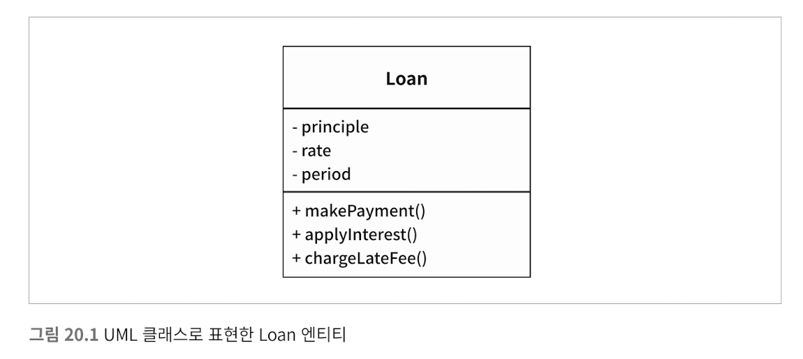

# 20장~25장

## 20장 업무규칙

- 업무 규칙 : 사업적으로 수익을 얻거나 비용을 줄일 수 있는 규칙 또는 절차 → 컴퓨터 상으로 구현했는지와 상관 없이 사업적으로 수익을 얻거나 비용을 줄일 수 있어야 한다.
- 핵심 업무 규칙 : 컴퓨터 프로그램을 통해 자동화하는 시스템이 없더라도 그 업무 규칙은 그대로 존재함. (ex. 대출에 N%의 이자를 부과한다는 사실)
- 핵심 업무 데이터 : 핵심 업무 규칙이 요구하는 데이터 (ex. 대출에선 대출 잔액, 이자율, 지급 일정) → 시스템으로 자동화되지 않은 경우에도 존재하는 데이터
- 엔티티: 핵심 규칙과 핵심 데이터는 본질적으로 결합되어 있어 객체로 만들기 좋음 → 이런 유형의 객체를 엔티티라고 하겠다

### 엔티티

- 엔티티 : 컴퓨터 시스템 내부의 객체, 핵심 업무 데이터를 기반으로 동작하는 일련의 조그마한 핵심 업무 규칙을 구체화 함 → 핵심 업무 데이터를 직접 포함하거나 그 데이터에 매우 쉽게 접근 가능
- 엔티티의 인터페이스 : 핵심 업무 데이터를 기반으로 동작하는 핵심 업무 규칙을 구현할 함수들로 구성

- 업무에서 핵심적인 개념을 구현하는 소프트웨어를 한데 모으고, 구축 중인 시스템으 다른 고려사항과 분리 → 오로지 업무에 대한 것
- 핵심 업무 데이터와 핵심 업무 규칙을 하나로 묶어 별도의 소프트웨어 모듈로 만들어야 함

### 유스케이스

- 유스케이스 : 자동화된 시스템이 사용되는 방법을 설명. 사용자가 제공해야 하는 입력, 사용자에게 제공할 출력, 해당 출력을 생성하기 위한 처리 단계를 기술
- 엔티티 내부의 핵심 업무 규칙을 어떻게, 그리고 언제 호출할 지를 명시하는 규칙을 담음
- 인터페이스로 들어오는 데이터와 인터페이스에서 되돌려주는 데이터를 형식 없이 명시한다는 점만 빼면 유스케이스는 사용자 인터페이스를 기술하지 않음 → 유스케이스 만으로는 웹을 통하는지 콘솔기반인지 등등 알 수 없음
    - 시스템이 사용자에게 어떻게 보이는 지가 아니라, 애플리케이션에 특화된 규칙을 설명 → 사용자와 엔티티 사이의 상호작용 규정, 시스템에서 데이터가 들어오고 나가는 방식은 유스케이스와 무관
- 엔티티와 같은 고수준 개념은 유스케이스와 같은 저수준 개념에 대해 아무것도 알지 못하지만 저수준인 유스케이스는 고수준인 엔티티에 대해 알고 있음
    - 엔티티는 수많은 애플리케이션에 대해 일반화됨, 유스케이스는 시스템의 입력이나 출력에 보다 가까이 위치함

### 요청 및 응답 모델

- 유스케이스는 입력 데이터를 받아서 출력 데이터를 생성 → 제대로 된 유스케이스 객체는 데이터를 사용자나 또 다른 컴포넌트와 주고 받는 방식에 대해서는 전혀 눈치챌 수 없어야 한다
- 요청 및 응답 모델이 독립적이지 않다면 그 모델에 의존하는 유스케이스도 결국 해당 모델이 수반하는 의존성에 간접적으로 결합되어 버린다
    - 이들 데이터 구조는 HTTPRequest등의 표준 프레임워크 인터페이스부터 파생되는 것이 아닌, 단순한 요청 데이터 구조 / 단순한 응답 데이터 구조로 입출력
- 엔티티 객체를 가리키는 참조를 요청 및 응답 데이터 구조에 포함하는 것은 공통 폐쇄 원칙과 단일 책임 원칙을 위배하게 됨 → 수많은 떠돌이 데이터가 만들어지고, 수많은 조건문이 추가됨 (단순히 인자만을 넘기는 중강함수가 생김)

### 결론

- 업무 규칙은 소프트웨어 시스템이 존재하는 이유. 핵심적인 기능
- 업무 규칙은 사용자 인터페이스나 데이터 베이스와 같은 저수준 관심사로 인해 오염되어서는 안되며 그대로의 모습으로 남아있어야 함
- 업무 규칙은 시스템에서 가장 독립적이며 가장 많이 재사용 할 수 있는 코드여야 함

## 21장 소리치는 아키텍처

### 아키텍처의 테마

- 야콥슨 - 소프트웨어 아키텍처는 시스템의 유스케이스를 지원하는 구조 → 소프트웨어 애플리케이션의 아키텍처도 애플리케이션의 유스케이스에 대해 소리쳐야 한다
- 프레임워크는 사용하는 도구일 뿐, 아키텍처가 준수해야 할 대상이 아니다 → 프레임워크를 중심으로 한 아키텍처는 유스케이스가 중심이 될 수 없다

### 아키텍처의 목적

- 좋은 아키텍처는 유스케이스를 그 중심에 두기 때문에 프레임워크나 도구, 환경에 전혀 구애받지 않고 유스케이스를 지원하는 구조를 아무 문제 없이 기술할 수 있다
- 좋은 소프트웨어 아키텍처는 프레임워크, 데이터베이스, 웹서버, 그리고 다른 개발 환경 문제나 도구에 대해서는 결정을 미룰 수 있게 해줌 → 유스케이스에만 중점을 두며 지엽적인 관심사에 대한 결합은 분리 시킴

### 하지만 웹은?

- 웹은 전달 매커니즘 (입출력 장치)이며 시스템 구조를 지배해서는 안된다 → 실제 애플리케이션을 웹으로 전달할지 여부는 미루어야 할 결정사항이고, 시스템 아키텍처는 시스템이 어떻게 전달될지에 대해 가능하다면 아무것도 몰라야 한다

### 프레임 워크는 도구일 뿐

- 어떻게 하면 아키텍처를 유스케이스에 중점을 둔 채 그대로 보존할 수 있을 지를 생각하고, 프레임워크가 아키텍처의 중심을 차지하는 일을 막을 수 있는 전략을 개발하라

### 테스트하기 쉬운 아키텍처

- 아키텍처가 유스케이스를 최우선으로 하고, 프레임워크와 적당한 거리를 둘다면 프레임워크를 전혀 준비하지 않더라도 필요한 유스케이스 전부에 대해 단위 테스트를 할 수 있어야 한다
    - 엔티티 객체는 반드시 오래된 방식을 간단한 객체여야 하며, 유스케이스 객체가 엔티티 객체를 조작해야 한다

### 결론

- 아키텍처는 시스템을 이야기해야 하며, 시스템에 적용한 프레임워크에 대해 이야기해서는 안된다

## 22장 클린 아키텍처

- 관심사의 분리 - 소프트웨어를 계층으로 분리함으로써 관심사의 분리라는 목표를 달성할 수 있다
    - 각 아키텍처는 최소한의 업무 규칙을 위한 계층 하나와, 사용자와 시스템 인터페이스를 위한 또 다른 계층 하나를 반드시 포함함
- 위 아키텍처(육각형 아키텍처, DCI, BCE) 들은 모두 시스템이 다음과 같은 특징을 지니도록 함
    - 프레임워크 독립성 : 프레임워크를 도구로 사용할 수 있으며 프레임워크가 지닌 제약사항 안으로 시스템을 욱여넣도록 강제하지 않는다
    - 테스트 용이성 : UI, 데이터베이스, 웹 서버 혹은 여타 외부 요소 없어도 테스트 할 수 있다
    - UI 독립성 : 시스템의 나머지 부분을 변경하지 않고도 UI를 쉽게 변경할 수 있다
    - 데이터베이스 독립성: 업무 규칙은 데이터베이스에 결합되지 않는다
    - 모든 외부 에이전시에 대한 독립성 : 실제로 업무 규칙은 외부 세계와의 인터페이스에 대해 전혀 알지 못한다

### 의존성 규칙

- 소스코드의 의존성은 반드시 안쪽으로, 고수준의 정책을 향해야 한다
- 내부의 원에 속한 요소는 외부의 원에 속한 어떤 것도 알지 못한다
- 외부의 원에 선언된 데이터 형식도 내부의 원에서 절대 사용해서는 안된다  →  특히 그 데이터 형식이 외부 원에 있는 프레임 워크가 생성한 것이라면 더더욱 안된다

#### 엔티티 

- 전사적인 핵심 업무 규칙을 캡슐화 함
- 전사적이지 않은 단순한 단일 애플리케이션을 작성하고 있다면 엔티티는 해당 애플리케이션의 업무 객체가 됨 → 이 경우 엔티티는 가장 일반적이며 고수준인 규칙을 캡슐화 함

#### 유스케이스

- 유스케이스 계층의 소프트웨어는 애플리케이션에 특화된 업무 규칙을 포함하고, 시스템의 모든 유스케이스를 캡슐화하고 구현함
- 이 계층에서의 변경이 엔티티에 영향을 주어서는 안됨. 또한 외부 요소의 변경이 이 계층에 영향을 주어서도 안됨
- 그러나 운영 관점에서 애플리케이션이 변경되면 유스케이스 계층의 소프트웨어에도 영향을 줌

#### 인터페이스 어댑터

- 이 계층은 일련의 어댑터들로 구성 → 어댑터는 데이터를 유스케이스와 엔티티에게 가장 편리한 형식에서 데이터베이스나 웹 같은 외부 에이전시에게 가장 편리한 형식으로 변환
    - 컨트롤러 → 유스케이스 / 유스케이스 → 프레젠터, 뷰 ) MVC 아키텍처가 이 계층에 들어감
- 이 계층은 데이터를 엔티티와 유스케이스에게 가장 편리한 형식에서 데이터베이스가 이용하기에 가장 편리한 형식으로 변환 - 그러나 데이터베이스를 알아서는 안됨
- 이 계층에는 데이터를 외부 서비스와 같은 외부 형식에서 유스케이스나 엔티티에서 사용되는 내부적인 형식으로 변환하는 또 다른 어댑터 필요
- 

#### 프레임워크와 드라이버

- 가장 바깥쪽 계층은 데이터베이스나 웹 프레임워크 같은 프레임워크, 도구 → 안쪽 원과 통신하기 위한 접합 코드외엔 필요한 코드가 많지 않음
- 모든 세부사항이 위치하는 곳

#### 원은 네 개여야만 하나

- 아니다. 그렇지만 어떠한 경우에도 의존성 규칙은 적용됨

#### 경계 횡단하기 

- 제어흐름 : 컨트롤러 → 유스케이스 → 프레젠터에서 실행
- 소스코드 위존성 : 의존성은 유스케이스를 향해 안쪽을 가리킴
- 제어흐름과 의존성의 방향이 명백히 반대여야 하는 경우, 대체로 의존성 역전 원칙으로 해결
    - 유스케이스에서 프레젠터를 호출해야한다고 가정하는 경우, 유스케이스가 유스케이스 출력 포트를 호출하도록 하고, 외부 원의 프래젠터가 그 인터페이스를 구현하도록 함
- 아키텍처 경계를 횡단할 때에도 동적 다형성을 이해 소스코드 의존성을 제어흐름과 반대로 만들고, 의존성 규칙을 준수하도록

#### 경계를 횡단하는 데이터는 어떤 모습일까

- 간단한 데이터 구조로 이뤄짐 - 기본적인 구조체 or 간단한 데이터 전송 객체 등
    - 중요한 점은 격리되어 있는 간단한 데이터 구조가 경계를 가로질러 전달된다는 것 → 데이터 구조가 어떤 의존성을 가져 의존성 규칙을 위배하길 바라지 않음
- 경계를 가로질러 데이터를 전달할 때, 데이터는 항상 내부의 원에서 사용하기에 가장 편리한 형태를 가져야만 한다

### 전형적인 시나리오

- 모든 의존성은 경계선을 안쪽으로 가로지르며, 의존성 규칙을 준수한다.

### 결론

- 소프트웨어를 계층으로 분리하고 의존성 규칙을 준수한다면 본질적으로 테스트하기 쉬운 시스템을 만들게 될 것이며 그에 따른 이점을 누릴 수 있다 .

## 23장 프레젠터와 험블 객체

- 프레젠터 → 험블 객체 패턴을 따른 형태로, 아키텍처 경계를 식별하고 보호하는 데 도움이 됨

### 험블 객체 패턴

- 행위를 두 개의 모듈 혹은 클래스로 나누고, 테스트하기 어려운 행위를 험블 객체로, 나머지 모듈에는 테스트하기 쉬운 행위들을 옮김
    - GUI는 단위 테스트가 어려운데 화면을 보면서 각 요소가 필요한 위치에 적절히 표시되었는지 검사하는 테스트는 작성하기 어려우므로 프레젠터와 뷰라는 클래스로 분리

### 프레젠터와 뷰

- 뷰는 험블 객체이고 테스트하기 어려움  → 뷰는 데이터를 화면으로 전달하는 간단한 일만 처리하도록 만듦
- 프레젠터는 테스트하기 쉬운 객체 → 애플리케이션으로부터 데이터를 받아 화면에 표현할 수 있는 포맷으로 만듦

### 테스트와 아키텍처

- 테스트 용이성은 좋은 아키텍처가 지녀야 할 속성 → 프레젠터와 뷰 사이 경계와 같은 험블 객체 패턴이 좋은 예

### 데이터베이스 게이트웨이

- 유스케이스 인터렉터와 데이터 베이스 사이에는 데이터베이스 게이트웨이가 위치
    - 이 게이트웨이는 다형적 인터페이스, 애플리케이션이 데이터베이스에 수행하는 생성, 조회, 갱신, 삭제 작업과 관련된 모든 메서드를 포함
- 유스케이스 계층은 필요한 메서드를 제공하는 게이트웨이 인터페이스를 호출, 인터페이스의 구현체는 데이터페이스 계층에 위치
    - 이 인터페이스 구현체는 험블 객체 → 임의의 인터페이스를 통해 게이트웨이메서드에 필요한 데이터에 접근함
    - 인터랙터는 험블객체가 아님 → 애플리케이션에 특화된 업무 규칙을 캡슐화 하기 때문에 ) 게이트웨이틑 스텁이나 테스트 더블로 적당히 교체할 수 있다

### 데이터 매퍼

- 객체는 데이터 구조가 아니기 때문에 ORM은 사실 존재하지 않는다 → 데이터는 private으로 선언되므로 사용자 관점에서 객체는 단순한 오퍼레이션의 집합이다
- 객체와 달리 데이터 구조는 public 데이터 변수의 집합 → ORM보다 데이터 매퍼라고 부르는 편이 나음
- ORM 시스템 → 데이터베이스 계층, ORM은 게이트웨이 인터페이스랑 데이터베이스 사이에서 일종의 또 다른 험블 객체 경계를 형성

### 서비스 리스너

- 애플리케이션은 데이터를 간단한 데이터 구조 형태로 로드, 이 데이터 구조 경계를 가로질러서 특정 모듈로 전달 → 그럼 해당 모듈은 데이터를 적절한 포맷으로 만들어서 외부 서비스로 전송
- 반대로 외부로부터 데이터를 수신하는 서비스는 서비스 리스너가 서비스 인터페이스로부터 데이터를 수신하고, 데이터를 애플리케이션에서 사용할 수 있게 데이터 구조로 포맷을 변경 → 이후 이 데이터 구조는 서비스 경계를 가로질러서 내부로 전달

### 결론

- 아키텍처의 경계마다 경계 가까이 숨어 있는 험블 객체 패턴을 발견할 수 있다 → 경계를 넘나드는 통신은 거의 모두 간단한 데이터 구조를 수반할 때가 많고, 대개 그 경계는 테스트하기 어려운 무언가와 테스트하기 쉬운 무언가로 분리될 것

## 24장 부분적 경계

- 아키텍처 경계를 완벽하게 만드는 데에는 비용이 많이 듦 → 부분적 경계를 고려해볼 수 있다

### 마지막 단계를 건너뛰기

- 부분적 경계를 생성하는 방법 중 하나는 독립적으로 컴파일하고 배포할 수 있는 컴포넌트를 만들기 위한 작업을 모두 수행한 후, 단일 컴포넌트에 그대로 모아만 두는 것
- 이러한 부분적 경계를 만들기 위해서 코드량과 사전 설계가 필요하지만, 다수의 컴포넌트를 관리하는 작업은 하지 않아도 된다

### 일차원 경계

- 완벽한 형태의 아키텍처는 양방향으로 격리된 상태를 유지해야 하므로 쌍방향 Boundary 인터페이스를 사용
- strategy 패턴을 이용해 추후 완벽한 형테의 경계로 확장할 수 있는 공간을 확보하고자 할 때 활용할 수 있는 더 간단한 구조를 구축할 수 있다

- Service Boundary 인터페이스는 클라이언트가 사용, ServiceImpl 클래스가 구현
- Client를 ServiceImpl로부터 격리시키는 데에 필요한 의존성 역전이 이미 적용됨
    - 아키텍처 경계를 위한 무대를 마련, 그러나 이러한 분리는 매우 빠르게 붕괴될 수 있음 - 점섬과 같은 비밀통로가 생기는 것을 막을 방법이 없음

### 퍼사드

- 경계는 Facade 클래스로만 간단히 정의, 의존성 역전까지도 희생
- Facade클래스에서는 모든 서비스 클래스를 메서드 형태로 정의, 서비스 호출이 발생하면 해당 서비스 클래스로 호출을 전달함, 클라이언트는 이들 서비스 클래서에 직접 접근 불과

- 서비스 클래스 중 하나에서 소스코드가 변경되면 무조건 client도 재컴파일 해야 함

### 결론

- 위 세 가지 접근법은 완벽한 형태의 경계를 담기 위한 공간으로써 적절하게 사용할 수 있는 상황이 서로 다르고 해당 경계과 실제로 구체화되지 않으면 가치가 떨어질 수 있다
- 아키텍처 경계가 언제, 어디에 / 완벽 or 부분적 구현할지를 결정하는 일 또한 아키텍트의 역할

## 25장  계층과 경계

- 시스템이 세 가지 컴포넌트 (UI, 업무규칙, 컴포넌트)로만 구성된다고 생각하기 쉬움
- 그러나 대다수의 시스템에서 컴포넌트는 이보다 훨씬 많음

### 옴퍼스 사냥 게임

- 게임 규칙은 독립적은 API로 UI 컴포넌트와 통신
- UI는 API를 사람이 이해할 수 있는 언어로 변환할 것

- 게임 규칙은 어떤 종류의 인간 언어를 사용하더라도 게임 규칙을 재사용 할 수 있다

### 클린 아키텍처?

- 위 예제는 클린 아키텍처 접근법을 적용해 유스 케이스, 경계, 엔티티, 관련 데이터 구조를 만드는 일을 쉬운 일처처럼 보이게 함
    - UI에서 언어가 유일한 변경의 축은 아니고, 텍스트 주고 받는 메커니즘을 다양하게 만들고 싶을 수 있음
    - 변경의 축에 의해 정의되는 아키텍처 경계가 잠재되어 있을 수 있음. 해당 경계를 가로지르는 그래서 언어를 통신 매커니즘으로부터 격리하는 API를 생성해야 할 수도 있음

- English, Spanish, Cloud Data와 같은 변형들은 추상 API 컴포넌트가 정의하는 다형적 인터페이스를 통해 제공되고, 실제로 서비스하는 구체 컴포넌트가 해당 인터페이스를 구현
- Text Delicery → Language → Game Rules  플로우는 사용자와의 통신에 관여 / Data Storage → Game Rules 플로우는 데이터 영속성에 관여

### 흐름 횡단하기

- 여러 사람과 함께 게임한다면 ? Network 컴포넌트 추가

- 시스템이 복잡해질수록 컴포넌트 구조는 더 많은 흐름으로 분리될 것

### 흐름 분리하기

- 게임 규칙 중 일부는 지도와 관련된 매커니즘을 처리 → 그러나 그것보다 더 높은 수준에는 또 다른 정책 집합이 존재
    - 플레이어의 생명력, 특정 사건을 해결하는 비용와 얻게될 소득 등을 알고 있는 그런 정책
    - 고수준 정책에 특정 사건이 발생했음을 알리면 고수준 정책에서는 플레이어의 상태를 관리
- 대규모 플레이어 동시 플레이 → PlaterManagement는 접속된 모든 MoveManagement 컴포넌트에 마이크로서비스 API를 제공, MoveManagemet는 플레이어의 컴퓨터에서 직접 처리
    
    
    
    → MoveMangement와 playerManagement 사이에는 완벽한 형태의 아키텍처 경계가 존재한다
    

### 결론

- 아키텍트로서 우리는 아키텍처 경계가 언제 필요한지를 신중하게 파악해내야 한다
- 경계가 무시되었다면 나중에 다시 추가하는 비용이 크다는 사실도 알아야
    - 프로젝트 초반에 구현할 경계가 무엇인지와 무시할 경계가 무엇인지를 쉽게 결정할 수 없으므로 지켜보고 경계가 필요할 수도 있는 부분에 주목
    - 경계가 존재하지 않아 생기는 마찰의 조짐이 보이면 경계 구현 비용과 무시 감수 비용을 가늠, 그 변곡점에서 경계 구현