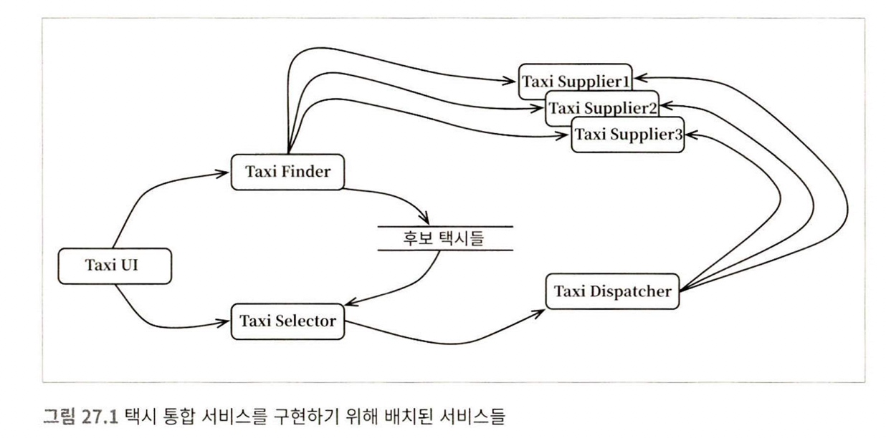

# Temp

- 26. 메인 컴포넌트
    
    메인은 1) 초기 조건과 설정을 구성, 2) 외부 자원 수집, 3) 제어권을 고수준 정책으로 넘기는 아키텍처 경계 바깥에 위치하는 플러그인이다.
  
- 27. ‘크고 작은 모든’ 서비스들
    
    
    
    서비스 중심으로 아키텍처가 구성(= 횡단 관심사)되어 기능 추가/변경에 어려움을 겪는 경우
    
    
    
    컴포넌트 기반으로 바람직하게 아키텍처가 구성된 경우
    
    서비스 그 자체로 아키텍처적으로 중요한 요소는 아니다. 그보다는 시스템의 경계와 경계 사이의 의존성 (저수준 ~ 고수준)에 따라 컴포넌트 기반으로 아키텍처를 구성하는 것이 바람직 하다.
  
- 28. 테스트 경계
    
    테스트는 아키텍처의 최외각에 위치하는 플러그인 중 하나로 시스템의 일부이다. 테스트를 고려하여 설계하여야 테스트가 유지보수에 취약해지지 않는다. 자주 변경되는 UI와 같은 것을 테스트하지 말고, 업무규칙을 검증할 수 있도록 노력하자.
  
- 29. 클린 임베디드 아키텍처
    
    
    
    소프트웨어를 하드웨어 의존적으로 작성하면 펌웨어 화 되기 쉽다. HAL, OSAL등을 최대한 활용하여 하드웨어와의 격리를 통해 소프트웨어의 가치를 유치해야 수명이 긴 코드를 구축할 수 있다.
  
- 30. 데이터베이스(= 디비)는 세부사항이다.
    
    디비와 같은 기술과 시스템은 아키텍처적으로 중요치 않다. 성능은 완전히 캡슐화하여 업무 규칙과는 분리할 수 있는 관심사다. 데이터는 중요할지 몰라도, 디비는 세부사항이다.